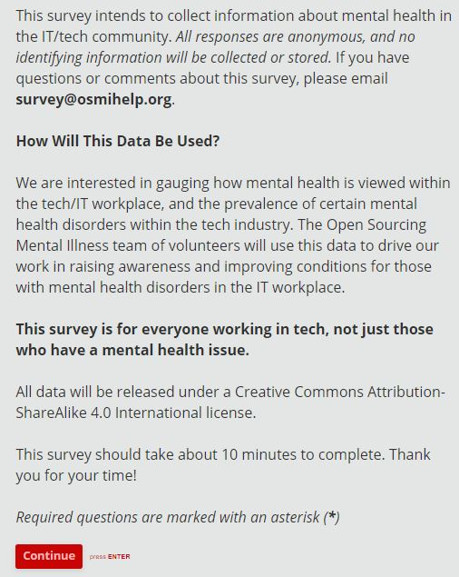

# Analyzing Tech Workers Perception of Discussing Mental Health Issues 

Sean Miller <millsea0@u.washington.edu>

## Abstract

This report seeks to further our understanding of the stigma against discussing mental health issues. We leverage two surveys (one in 2014 and one in 2016) collected by Open Sourcing Mental Illness Inc [OSMI](https://osmihelp.org/research/) which specifically targeted information technology (IT) workers and collected data about if they have mental health benefits and how they perceive discussing mental health issues at work. Using two of the questions used in both surveys we derive if a survey participant perceived discussing mental health issues at work to have more, equivalent or fewer consequences than discussing physical health issues. We then use a two-sided proportion z-test to analyze if the proportion of participants that view discussing mental health issues at work as having more consequences changed between the surveys. We found that there was not a statistically significant difference in this metric when comparing the surveys.

All of the data and code used for this analysis is provided within this repository.

##### Structure of Repo
```
data-512-a5
| - clean_data (Contains any cleaned and processed data sets)
| - | - mental-heath-in-tech-2014_clean.csv
| - | - mental-heath-in-tech-2016_clean.csv
| - raw_data (Contains any raw data such as responses from the ORES API)
| - | - mental-heath-in-tech-2014.csv
| - | - mental-heath-in-tech-2016_20161114.csv
| - outputs
| - | - 2014_age_distribution.png
| - | - 2014_mental_health_perception.png
| - | - 2014_top_10_countries.png
| - | - 2016_age_distribution.png
| - | - 2016_mental_health_perception.png
| - | - 2016_top_10_countries.png
| - pictures (Contains pictures for the README that aren't outputs of the notebook)
| - | - SurveyIntroduction.jpg
| - data-512-final-project.ipynb (The Jupyter Notebook)
| - LICENSE
| - READEME.md
```

#### Data Sets

The data sets that I'll be using for this project are survey results collected by [OSMI](https://osmihelp.org/research/) and are made available by the [CC-BY-SA 4.0](https://creativecommons.org/licenses/by-sa/4.0/) license. One survey was performed in 2014 and the other in 2016. Both of the surveys seek to understand how people that work in technology view mental health issues and to understand what support they receive from their employer.

OSMI has made the data sets for both the [2014 survey](https://www.kaggle.com/osmi/mental-health-in-tech-survey/data) and the [2016 survey](https://www.kaggle.com/osmi/mental-health-in-tech-2016) available on Kaggle.

To ensure open access to the data, I have uploaded the data in CSV format to [figshare](https://doi.org/10.6084/m9.figshare.5579458.v1) with a description of each column/question. In 2014 the columns were labeled by a keyword to indicate the question asked, I have provided this mapping in the [appendix](#additional-images) of this document.

When a user opts in to taking the survey they are presented with the [context](#additional-images) of how results of the survey will be used. This includes the intent of the survey, how the data will be shared, the license it will be shared under, and a way to follow up with OSMI in the case that they have any questions.[[3]](#References)

All of the data from surveys has been anonymized such that we are only given a participant's age, location, and state when applicable.

#### Software

This analysis is conducted in [Python 3.6.0](https://www.python.org/), uses [Pandas dataframes](https://pandas.pydata.org/pandas-docs/stable/generated/pandas.DataFrame.html) to manipulate and transform data, and uses [Matplotlib](https://matplotlib.org/) for visualizations.

The analysis will be published in a [Jupyter Notebook](http://jupyter.org/) and all code used will be made available on my [GitHub](https://github.com/awfuldynne/).

All of the code will be written and tested against the default packages present in **Anaconda3 v4.4.0**. You can find a download for Anaconda and its latest versions at <https://repo.continuum.io/archive/>.

### References

[1] CORRIGAN, PATRICK W, and AMY C WATSON. “Understanding the Impact of Stigma on People with Mental Illness.” World Psychiatry 1.1 (2002): 16–20. https://www.ncbi.nlm.nih.gov/pmc/articles/PMC1489832/#B13. Accessed 5 Nov. 2017.

[2] Ltd, Open Sourcing Mental Illness. “Research :: Open Sourcing Mental Illness” 2015-2017, [www.osmihelp.org/research](www.osmihelp.org/research). Accessed 5 Nov. 2017.

[3] National Alliance on Mental Illness. "StigmaFree" 2017, <https://www.nami.org/stigmafree>. Accessed 5 Nov. 2017.

[4] Ed Finkler. "The 2016 @OSMIhelp Mental Health in Tech survey is NOW LIVE! Please take & share w colleagues! http://j.mp/osmisurvey2016  #MentalHealthInTech" <https://twitter.com/funkatron/status/709376847600099328>. 14 Mar 2016 6:53 AM. Tweet.

[5] Ltd, Open Sourcing Mental Illness. "OSMI Mental Health in Tech Survey 2016" 2016, <https://cojfunkatroncom.typeform.com/to/Ao6BTw>. Accessed 5 Nov. 2017.

[6] Singletary et al. "Young people’s perceptions of mental and physical health in the context of general wellbeing." Abstract. Health Education Journal Vol 74, Issue 3, pp. 257 - 269. First Published June 4, 2014. <http://journals.sagepub.com/doi/10.1177/0017896914533219>. Accessed 6 Nov. 2017.

[7] U.S. Department of Health & Human Services. "Health Insurance Coverage and the Affordable Care Act, 2010-2016". 2016. <https://aspe.hhs.gov/pdf-report/health-insurance-coverage-and-affordable-care-act-2010-2016>. Accessed 6 Nov. 2017.

### Appendix

###### Data Set Descriptions

**2014 Survey**

| Column Name | Question | Data Description/Values Overview |
| ---------------- | -------- | ---------------- |
| Timestamp | N/A | Timestamp the survey was submitted |
| Age | What is your age? | Number of years old the person is |
| Gender | What is your gender? | String stating gender of the person |
| Country | What country do you live in? | Country the person lives in |
| state	| If they live in the United States, what state do they live in? | Full name of state |
| self_employed | Are you self-employed? | Yes/No/NA |
| family_history | Do you have a family history of mental illness? | Yes/No |
| treatment | Have you sought treatment for a mental health condition? | Yes/No |
| work_interfere | If you have a mental health condition, do you feel that it interferes with your work? | Never/Rarely/Sometimes/Often/NA |
| no_employees | How many employees does your company or organization have? | Category for number of employees (e.g. "100-500") |
| remote_work | Do you work remotely (outside of an office) at least 50% of the time? | Yes/No |
| tech_company | Is your employer primarily a tech company/organization? | Yes/No |
| benefits | Does your employer provide mental health benefits? | Yes/No/Don't Know |
| care_options | Do you know the options for mental health care your employer provides? | Yes/No/Not Sure |
| wellness_program | Has your employer ever discussed mental health as part of an employee wellness program? | Yes/No/Don't Know |
| seek_help | Does your employer provide resources to learn more about mental health issues and how to seek help? | Yes/No/Don't Know |
| anonymity | Is your anonymity protected if you choose to take advantage of mental health or substance abuse treatment resources? | Yes/No/Don't Know |
| leave | How easy is it for you to take medical leave for a mental health condition? | Very Difficult/Somewhat Difficult/Somewhat Easy/Very Easy/Don't Know |
| mental_health_consequence | Do you think that discussing a mental health issue with your employer would have negative consequences? | Yes/No/Maybe |
| phys_health_consequence | Do you think that discussing a physical health issue with your employer would have negative consequences? | Yes/No/Maybe |
| coworkers | Would you be willing to discuss a mental health issue with your coworkers? | Yes/No/Some |
| supervisor | Would you be willing to discuss a mental health issue with your direct supervisor(s)? | Yes/No/Some |
| mental_health_interview | Would you bring up a mental health issue with a potential employer in an interview? | Yes/No/Maybe |
| phys_health_interview | Would you bring up a physical health issue with a potential employer in an interview? | Yes/No/Maybe |
| mental_vs_physical | Do you feel that your employer takes mental health as seriously as physical health? | Yes/No/Don't Know |
| obs_consequence | Have you heard of or observed negative consequences for coworkers with mental health conditions in your workplace? | Yes/No |
| comments | N/A | Any additional comments the person had or NA |

Jupyter NotebookLogout Abstract_Final_Project Last Checkpoint: 15 minutes ago (unsaved changes) Python 3
Python 3 Trusted
File
Edit
View
Insert
Cell
Kernel
Widgets
Help


# Analyzing Tech Workers Perception of Discussing Mental Health Issues 
# Analyzing Tech Workers Perception of Discussing Mental Health Issues 

-
## Abstract
​
This report seeks to further our understanding of the stigma against discussing mental health issues. We leverage two surveys (one in 2014 and one in 2016) collected by Open Sourcing Mental Illness Inc [OSMI](https://osmihelp.org/research/) which specifically targeted information technology (IT) workers and collected data about if they have mental health benefits and how they perceive discussing mental health issues at work. Using two of the questions used in both surveys we derive if a survey participant perceived discussing mental health issues at work to have more, equivalent or fewer consequences than discussing physical health issues. We then use a two-sided proportion z-test to analyze if the proportion of participants that view discussing mental health issues at work as having more consequences changed between the surveys. We found that there was not a statistically significant difference in this metric when comparing the surveys.
​
All of the data and code used for this analysis is provided within this repository.

-
##### Structure of Repo
```
data-512-a5
| - clean_data (Contains any cleaned and processed data sets)
| - | - mental-heath-in-tech-2014_clean.csv
| - | - mental-heath-in-tech-2016_clean.csv
| - raw_data (Contains any raw data such as responses from the ORES API)
| - | - mental-heath-in-tech-2014.csv
| - | - mental-heath-in-tech-2016_20161114.csv
| - outputs
| - | - 2014_age_distribution.png
| - | - 2014_mental_health_perception.png
| - | - 2014_top_10_countries.png
| - | - 2016_age_distribution.png
| - | - 2016_mental_health_perception.png
| - | - 2016_top_10_countries.png
| - pictures (Contains pictures for the README that aren't outputs of the notebook)
| - | - SurveyIntroduction.jpg
| - data-512-final-project.ipynb (The Jupyter Notebook)
| - LICENSE
| - READEME.md
```
​
#### Data Sets
​
The data sets that I'll be using for this project are survey results collected by [OSMI](https://osmihelp.org/research/) and are made available by the [CC-BY-SA 4.0](https://creativecommons.org/licenses/by-sa/4.0/) license. One survey was performed in 2014 and the other in 2016. Both of the surveys seek to understand how people that work in technology view mental health issues and to understand what support they receive from their employer.
​
OSMI has made the data sets for both the [2014 survey](https://www.kaggle.com/osmi/mental-health-in-tech-survey/data) and the [2016 survey](https://www.kaggle.com/osmi/mental-health-in-tech-2016) available on Kaggle.
​
To ensure open access to the data, I have uploaded the data in CSV format to [figshare](https://doi.org/10.6084/m9.figshare.5579458.v1) with a description of each column/question. In 2014 the columns were labeled by a keyword to indicate the question asked, I have provided this mapping in the [appendix](#additional-images) of this document.
​
When a user opts in to taking the survey they are presented with the [context](#additional-images) of how results of the survey will be used. This includes the intent of the survey, how the data will be shared, the license it will be shared under, and a way to follow up with OSMI in the case that they have any questions.[[3]](#References)
​
All of the data from surveys has been anonymized such that we are only given a participant's age, location, and state when applicable.
​
#### Software
​
This analysis is conducted in [Python 3.6.0](https://www.python.org/), uses [Pandas dataframes](https://pandas.pydata.org/pandas-docs/stable/generated/pandas.DataFrame.html) to manipulate and transform data, and uses [Matplotlib](https://matplotlib.org/) for visualizations.
​
The analysis will be published in a [Jupyter Notebook](http://jupyter.org/) and all code used will be made available on my [GitHub](https://github.com/awfuldynne/).
​
All of the code will be written and tested against the default packages present in **Anaconda3 v4.4.0**. You can find a download for Anaconda and its latest versions at <https://repo.continuum.io/archive/>.

-
### References
​
[1] CORRIGAN, PATRICK W, and AMY C WATSON. “Understanding the Impact of Stigma on People with Mental Illness.” World Psychiatry 1.1 (2002): 16–20. https://www.ncbi.nlm.nih.gov/pmc/articles/PMC1489832/#B13. Accessed 5 Nov. 2017.
​
[2] Ltd, Open Sourcing Mental Illness. “Research :: Open Sourcing Mental Illness” 2015-2017, [www.osmihelp.org/research](www.osmihelp.org/research). Accessed 5 Nov. 2017.
​
[3] National Alliance on Mental Illness. "StigmaFree" 2017, <https://www.nami.org/stigmafree>. Accessed 5 Nov. 2017.
​
[4] Ed Finkler. "The 2016 @OSMIhelp Mental Health in Tech survey is NOW LIVE! Please take & share w colleagues! http://j.mp/osmisurvey2016  #MentalHealthInTech" <https://twitter.com/funkatron/status/709376847600099328>. 14 Mar 2016 6:53 AM. Tweet.
​
[5] Ltd, Open Sourcing Mental Illness. "OSMI Mental Health in Tech Survey 2016" 2016, <https://cojfunkatroncom.typeform.com/to/Ao6BTw>. Accessed 5 Nov. 2017.
​
[6] Singletary et al. "Young people’s perceptions of mental and physical health in the context of general wellbeing." Abstract. Health Education Journal Vol 74, Issue 3, pp. 257 - 269. First Published June 4, 2014. <http://journals.sagepub.com/doi/10.1177/0017896914533219>. Accessed 6 Nov. 2017.
​
[7] U.S. Department of Health & Human Services. "Health Insurance Coverage and the Affordable Care Act, 2010-2016". 2016. <https://aspe.hhs.gov/pdf-report/health-insurance-coverage-and-affordable-care-act-2010-2016>. Accessed 6 Nov. 2017.

-
### Appendix
​
###### Data Set Descriptions
​
**2014 Survey**
​
| Column Name | Question | Data Description/Values Overview |
| ---------------- | -------- | ---------------- |
| Timestamp | N/A | Timestamp the survey was submitted |
| Age | What is your age? | Number of years old the person is |
| Gender | What is your gender? | String stating gender of the person |
| Country | What country do you live in? | Country the person lives in |
| state | If they live in the United States, what state do they live in? | Full name of state |
| self_employed | Are you self-employed? | Yes/No/NA |
| family_history | Do you have a family history of mental illness? | Yes/No |
| treatment | Have you sought treatment for a mental health condition? | Yes/No |
| work_interfere | If you have a mental health condition, do you feel that it interferes with your work? | Never/Rarely/Sometimes/Often/NA |
| no_employees | How many employees does your company or organization have? | Category for number of employees (e.g. "100-500") |
| remote_work | Do you work remotely (outside of an office) at least 50% of the time? | Yes/No |
| tech_company | Is your employer primarily a tech company/organization? | Yes/No |
| benefits | Does your employer provide mental health benefits? | Yes/No/Don't Know |
| care_options | Do you know the options for mental health care your employer provides? | Yes/No/Not Sure |
| wellness_program | Has your employer ever discussed mental health as part of an employee wellness program? | Yes/No/Don't Know |
| seek_help | Does your employer provide resources to learn more about mental health issues and how to seek help? | Yes/No/Don't Know |
| anonymity | Is your anonymity protected if you choose to take advantage of mental health or substance abuse treatment resources? | Yes/No/Don't Know |
| leave | How easy is it for you to take medical leave for a mental health condition? | Very Difficult/Somewhat Difficult/Somewhat Easy/Very Easy/Don't Know |
| mental_health_consequence | Do you think that discussing a mental health issue with your employer would have negative consequences? | Yes/No/Maybe |
| phys_health_consequence | Do you think that discussing a physical health issue with your employer would have negative consequences? | Yes/No/Maybe |
| coworkers | Would you be willing to discuss a mental health issue with your coworkers? | Yes/No/Some |
| supervisor | Would you be willing to discuss a mental health issue with your direct supervisor(s)? | Yes/No/Some |
| mental_health_interview | Would you bring up a mental health issue with a potential employer in an interview? | Yes/No/Maybe |
| phys_health_interview | Would you bring up a physical health issue with a potential employer in an interview? | Yes/No/Maybe |
| mental_vs_physical | Do you feel that your employer takes mental health as seriously as physical health? | Yes/No/Don't Know |
| obs_consequence | Have you heard of or observed negative consequences for coworkers with mental health conditions in your workplace? | Yes/No |
| comments | N/A | Any additional comments the person had or NA |

**2016 Survey**
​
| Column Name/Question | Data Description/Values Overview |
| -------------------- | ----------------------- |
| Are you self-employed? | Boolean value |
| How many employees does your company or organization have? | Category for number of employees (e.g. "100-500") |
| Is your employer primarily a tech company/organization? | Boolean value or blank |
| Is your primary role within your company related to tech/IT? | Boolean value or blank |
| Does your employer provide mental health benefits as part of healthcare coverage? | Yes/No/Not eligible/I don't know or blank |
| Do you know the options for mental health care available under your employer-provided coverage? | Yes/No/NA/Not sure or blank |
| Has your employer ever formally discussed mental health (for example, as part of a wellness campaign or other official communication)? | Yes/No/I don't know or blank |
| Does your employer offer resources to learn more about mental health concerns and options for seeking help? | Yes/No/I don't know or blank |
| Is your anonymity protected if you choose to take advantage of mental health or substance abuse treatment resources provided by your employer? | Yes/No/I don't know or blank |
| If a mental health issue prompted you to request a medical leave from work, asking for that leave would be: | Very Difficult/Somewhat Difficult/Neither easy nor difficult/Somewhat Easy/Very Easy/Don't Know or blank |
| Do you think that discussing a mental health disorder with your employer would have negative consequences? | Yes/No/Maybe or blank |
| Do you think that discussing a physical health issue with your employer would have negative consequences? | Yes/No/Maybe or blank |
| Would you feel comfortable discussing a mental health disorder with your coworkers? | Yes/No/Maybe or blank |
| Would you feel comfortable discussing a mental health disorder with your direct supervisor(s)? | Yes/No/Maybe or blank |
| Do you feel that your employer takes mental health as seriously as physical health? | Yes/No/I don't know or blank |
| Have you heard of or observed negative consequences for co-workers who have been open about mental health issues in your workplace? | Yes/No or blank |
| Do you have medical coverage (private insurance or state-provided) which includes treatment of  mental health issues? | Boolean value or blank |
| Do you know local or online resources to seek help for a mental health disorder? | None/Some/Several or blank |
| If you have been diagnosed or treated for a mental health disorder, do you ever reveal this to clients or business contacts? | Yes/Sometimes/No, doesn't matter/No, would have negative impact/Not applicable or blank |
| If you have revealed a mental health issue to a client or business contact, do you believe this has impacted you negatively? | Yes/No/NA/Not sure or blank |
| If you have been diagnosed or treated for a mental health disorder, do you ever reveal this to coworkers or employees? | Yes/Sometimes/No, doesn't matter/No, would have negative impact/Not applicable or blank |
| If you have revealed a mental health issue to a coworker or employee, do you believe this has impacted you negatively? | Yes/No/Unsure/Not applicable or blank |
| Do you believe your productivity is ever affected by a mental health issue? | Yes/No/Unsure/Not applicable or blank |
| If yes, what percentage of your work time (time performing primary or secondary job functions) is affected by a mental health issue? | Binned representation of percent of time (e.g. "1-25%")
| Do you have previous employers? | Boolean value |
| Have your previous employers provided mental health benefits? | Yes/No/Some/I don't know or blank |
| Were you aware of the options for mental health care provided by your previous employers? | Yes/No/Some/NA or blank |
| Did your previous employers ever formally discuss mental health (as part of a wellness campaign or other official communication)? | None/Some/Yes/I don't know or blank |
| Did your previous employers provide resources to learn more about mental health issues and how to seek help? | None/Some/Yes or blank |
| Was your anonymity protected if you chose to take advantage of mental health or substance abuse treatment resources with previous employers? | Yes/No/Sometimes/I don't know or blank |
| Do you think that discussing a mental health disorder with previous employers would have negative consequences? | Yes/No/Some/I don't know or blank |
| Do you think that discussing a physical health issue with previous employers would have negative consequences? | Yes/No/Some/I don't know or blank |
| Would you have been willing to discuss a mental health issue with your previous co-workers? | Yes/No/Some or blank |
| Would you have been willing to discuss a mental health issue with your direct supervisor(s)? | Yes/No/Some/I don't know or blank |
| Did you feel that your previous employers took mental health as seriously as physical health? | None did/Some did/Yes, they all did/I don't know or blank |
| Did you hear of or observe negative consequences for co-workers with mental health issues in your previous workplaces? | None of them/Some of them/Yes, all of them or blank |
| Would you be willing to bring up a physical health issue with a potential employer in an interview? | Yes/No/Maybe |
| Why or why not? | Explanation of previous question |
| Would you bring up a mental health issue with a potential employer in an interview? | Yes/No/Maybe |
| Why or why not? | Explanation of previous question |
| Do you feel that being identified as a person with a mental health issue would hurt your career? |  Yes, I think it would/Yes, it has/No, I don't think it would/No, it hasn't/Maybe |
| Do you think that team members/co-workers would view you more negatively if they knew you suffered from a mental health issue? | Yes, I think they would/Yes, they do/No, I don't think they would/No, they don't/Maybe |
| How willing would you be to share with friends and family that you have a mental illness? | Not applicable/Not open/Somewhat not open/Neutral/Somewhat open/Very open |
| Have you observed or experienced an unsupportive or badly handled response to a mental health issue in your current or previous workplace? | Yes, I experienced/Yes, I observed/No/Maybe/NA |
| Have your observations of how another individual who discussed a mental health disorder made you less likely to reveal a mental health issue yourself in your current workplace? | Yes/No/Maybe/NA or blank |
| Do you have a family history of mental illness? | Yes/No/I don't know |
| Have you had a mental health disorder in the past? | Yes/No/Maybe |
| Do you currently have a mental health disorder? | Yes/No/Maybe |
| If yes, what condition(s) have you been diagnosed with? | String representation of condition(s) or blank |
| If maybe, what condition(s) do you believe you have? | String representation of condition(s) or blank |
| Have you been diagnosed with a mental health condition by a medical professional? | Yes/No |
| If so, what condition(s) were you diagnosed with? | String representation of condition(s) or blank |
| Have you ever sought treatment for a mental health issue from a mental health professional? | Boolean value |
| If you have a mental health issue, do you feel that it interferes with your work when being treated effectively? | NA/Never/Rarely/Sometimes/Often |
| If you have a mental health issue, do you feel that it interferes with your work when NOT being treated effectively? | NA/Never/Rarely/Sometimes/Often |
| What is your age? | Number of years old the person is |
| What is your gender? | String stating gender of the person |
| What country do you live in? | Country the person lives in |
| What US state or territory do you live in? | Full name of state |
| What country do you work in? | Country the person works in |
| What US state or territory do you work in? | Full name of state |
| Which of the following best describes your work position? | String description of their job roles |
| Do you work remotely? | Always/Sometimes/Never |

### Additional Images

[[5]](#references)


